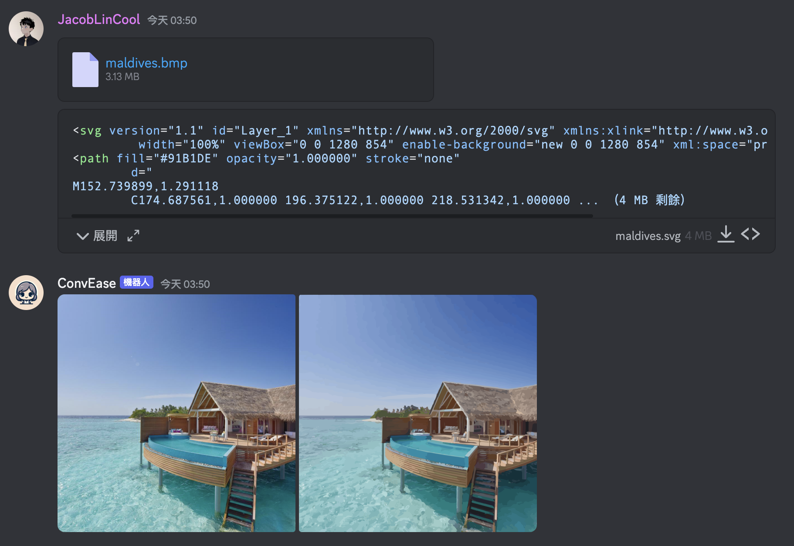

# ConvEase

ConvEase effortlessly converts and transcribes media on Discord, making every conversation accessible and streamlined.

## Better Preview

| File Type                     | To                | Status     |
| ----------------------------- | ----------------- | ---------- |
| BMP (`image/bmp`)             | PNG (`image/png`) | ✅          |
| SVG (`image/svg+xml`)         | PNG (`image/png`) | ✅          |
| AVIF (`image/avif`)           | PNG (`image/png`) | ✅          |
| TIFF (`image/tiff`)           | PNG (`image/png`) | ✅          |
| AI (`application/postscript`) | PNG (`image/png`) | ✅          |
| HTML (`text/html`)            | PNG (`image/png`) | ✅          |
| PDF (`application/pdf`)       | PNG (`image/png`) | ✅ (1 page) |
| WAV (`audio/wav`)             | Transcription     | WIP        |
| MP3 (`audio/mpeg`)            | Transcription     | WIP        |
| OGG (`audio/ogg`)             | Transcription     | WIP        |

## Screenshots



## Deployment

Create a `.env` file in the root directory first, see [`.env.example`](./.env.example) for reference.

### Docker Compose

```sh
docker compose -f deployment/docker-compose.yml up -d
```

### Kubernetes

Please use [`deployment/kubernetes.yml`](./deployment/kubernetes.yml) as resource and use yours kustomization config to set the secret.

An example of kustomization config is provided in [`deployment/kustomization.yml`](./deployment/kustomization.yml).
